# Old-School Essentials Character Creator

A full-featured character generator for Old-School Essentials (OSE). Roll classic stats, select races and classes, manage gear and encumbrance, and export a print-ready PDF. The app also supports optional AI-powered name, trait, portrait, and backstory generation using Google Gemini.

This project integrates **Apostol Apostolov's extensive houserules for Old School Essentials**. The overhaul focuses on modern clarity and consistency while keeping old‑school tension, resource pressure, and player agency intact. Full rules: [rules/OSE_HOUSE_RULES.md](rules/OSE_HOUSE_RULES.md).

Key additions and changes include:

- **Modernized combat math**: explicit Ascending AC and To‑Hit conversion guidelines.
- **Score generation with safety valves**: 3d6 in order, shared sets, plus limited post‑roll adjustments.
- **Tougher early survivability**: racial hit die and max HP at level 1, with rerolls for 1–2 on later HD.
- **Class overhaul across the Advanced Player’s Tome**: rebalanced requirements to reflect demographic availability, plus new features so every class feels viable and interesting without trap choices.
- **Economy & advancement rebalanced**: XP is tuned to silver‑based progression for modern, longer‑term campaigns.
- **Spell access as a journey**: curated starting spells, random selection with player agency, and research/mentorship for new spells.
- **Alignment with meaning**: alignment is a roleplay force with real consequences, not just a label.
- **Encumbrance that actually matters**: clean thresholds, STR modifiers, and distinct carried‑weight states.
- **Group‑centric resolution**: X‑in‑6 and skill checks emphasize party effort and shared luck.
- **Grog hirelings**: a single loyal companion for fragile casters, with clear limits.
- **Meaningful downtime**: structured activities like carousing and philanthropy, plus long‑term study and literacy improvement, to make between‑adventure time feel real and consequential.

## Badges


## Features

### 1) Choose Your Setting

Load one or more supported source settings to expand the generator with unique mechanics, new steps, classes, equipment, and spells. You can mix sources per character, and more settings will be added over time.

<p align="center">
  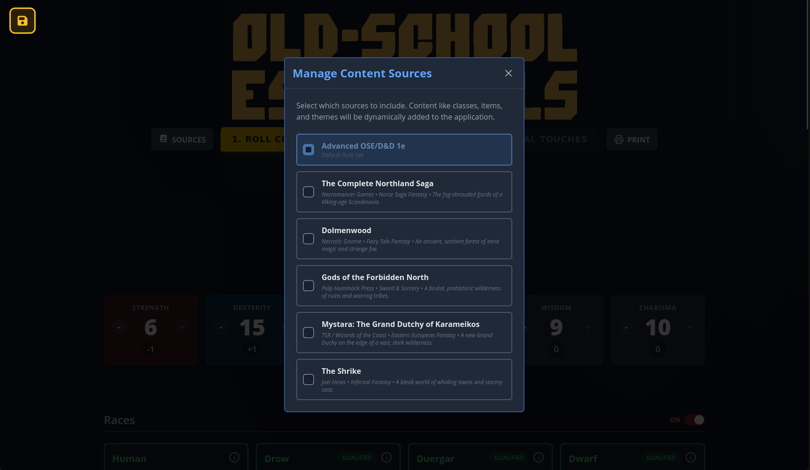
</p>

### 2) Start & Roll Your Character

Kick off your character on the Roll Character tab. Roll your stats, glance at your options, and move through the journey at your own pace.

<p align="center">
  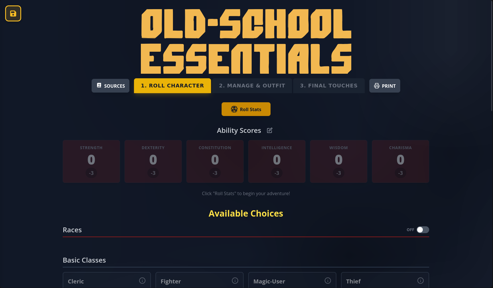
  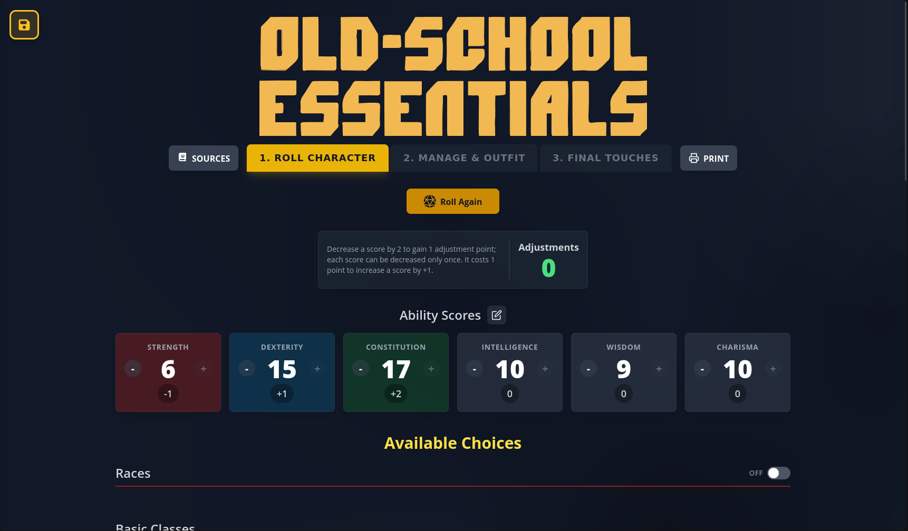
</p>

### 3) Manual Scores (DM Approved)

If your table uses manual scores, a DM approval gate keeps things fair. The entry screen includes quick-fill helpers for common roll styles so you can get going fast.

<p align="center">
  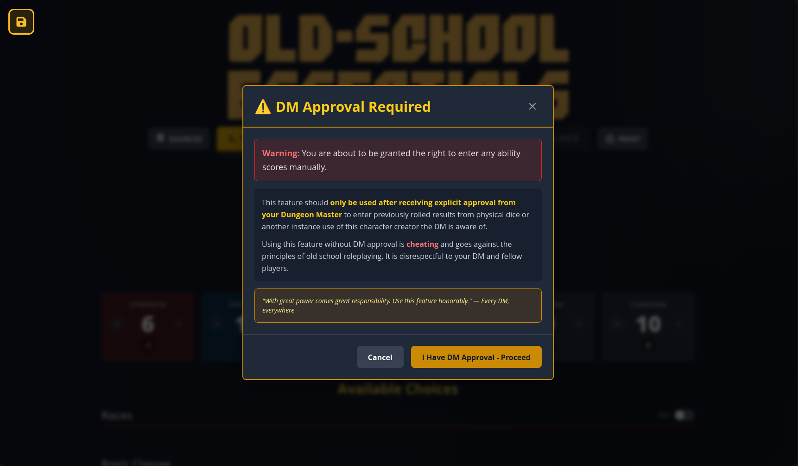
  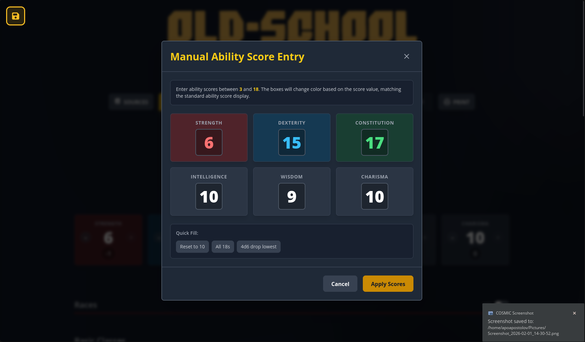
</p>

### 4) Pick Race & Class

Pick a race and class with clear requirements, modifiers, and eligibility badges. Open the detail panels to see full rules context before locking anything in.

<p align="center">
  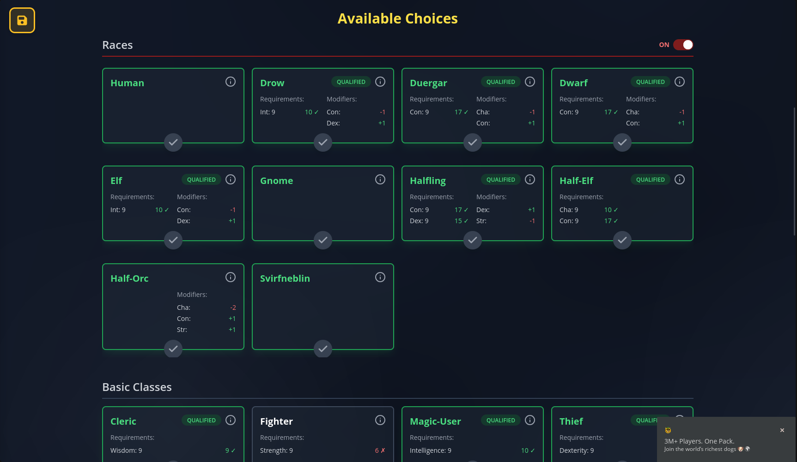
  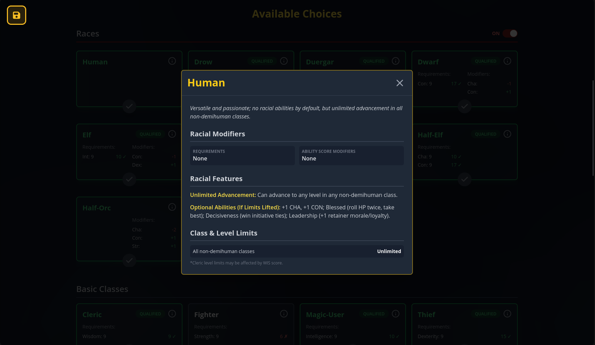
  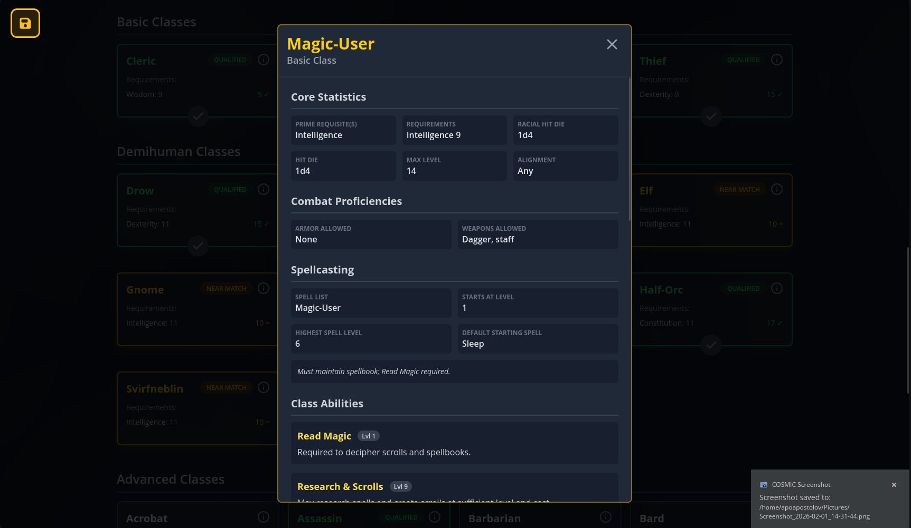
</p>

### 5) Manage & Outfit

Choose your starting level, roll your wealth, and gear up. Kits get you playing quickly, and you can still customize gear breakdowns along the way.

<p align="center">
  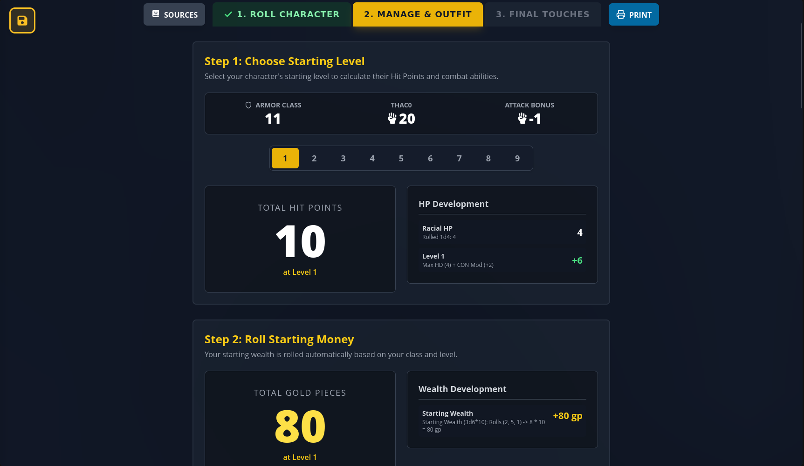
  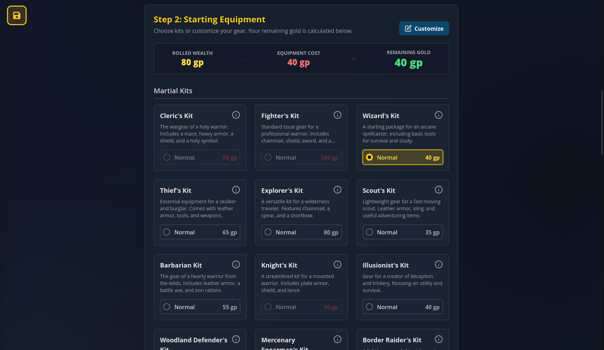
  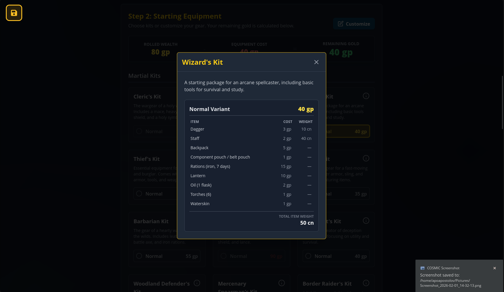
</p>

### 6) Customize Equipment

Drag items between the catalog and your inventory to fine‑tune your kit. Gold and encumbrance update live, so you always know where you stand.

<p align="center">
  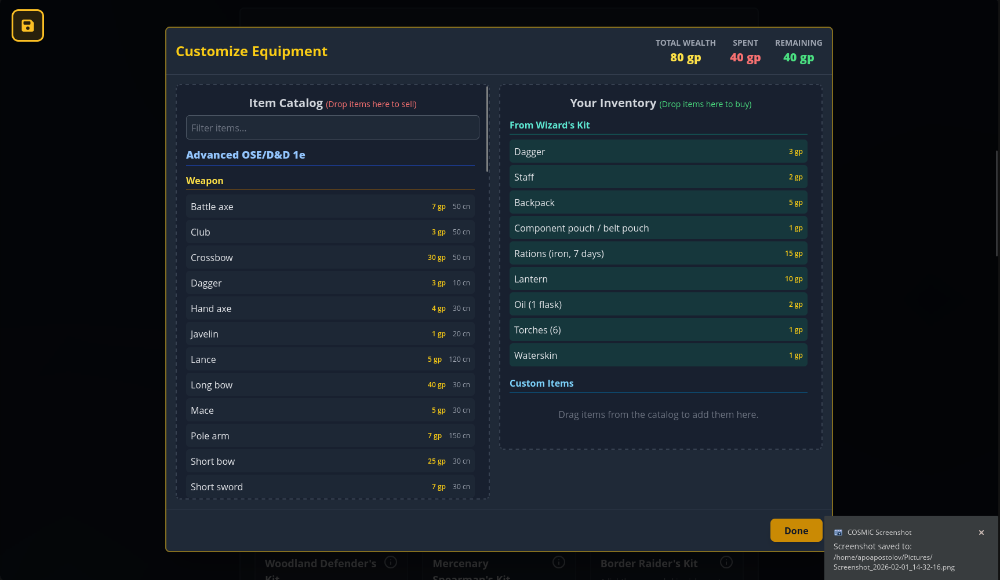
</p>

### 7) Starting Magic & Personal Grog

Spellcasters pick favorites and let fate decide a starting spell. If your class qualifies, you can also generate a personal grog with stats, gear, and a portrait—ready to hit the table.

<p align="center">
  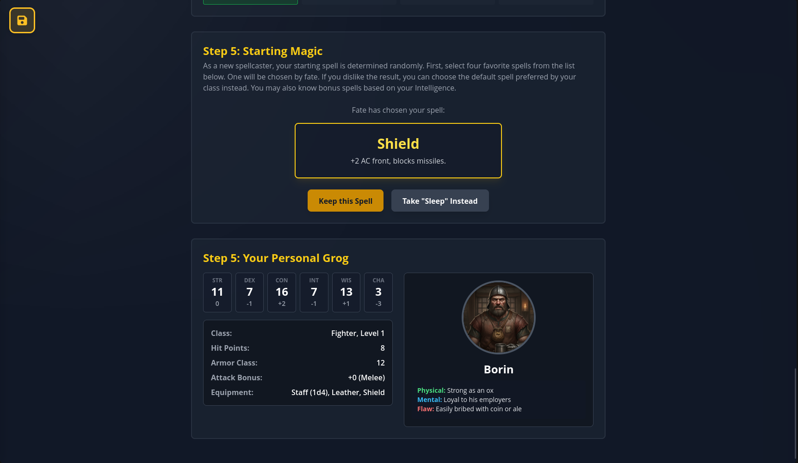
</p>

### 8) Final Touches (AI‑Enhanced)

Choose your world and gender, generate a name and traits, then create a portrait. Prompts are visible so you can see exactly what the AI is using.

<p align="center">
  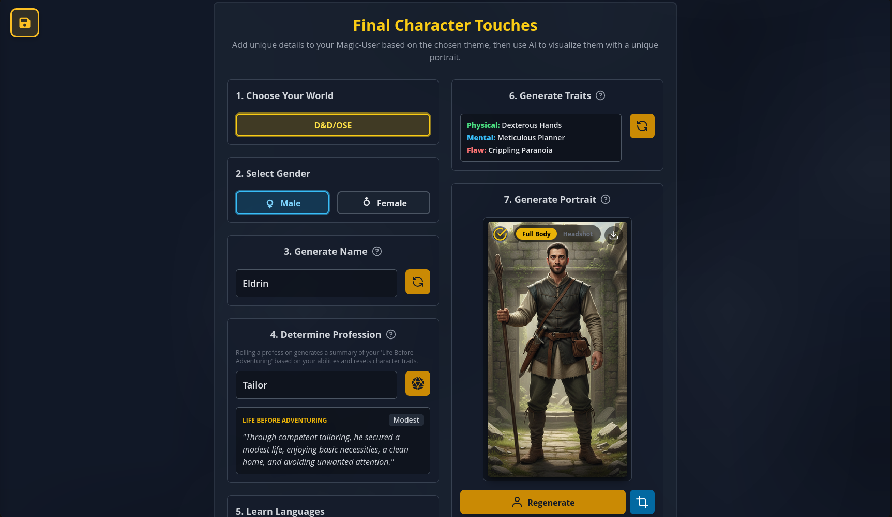
  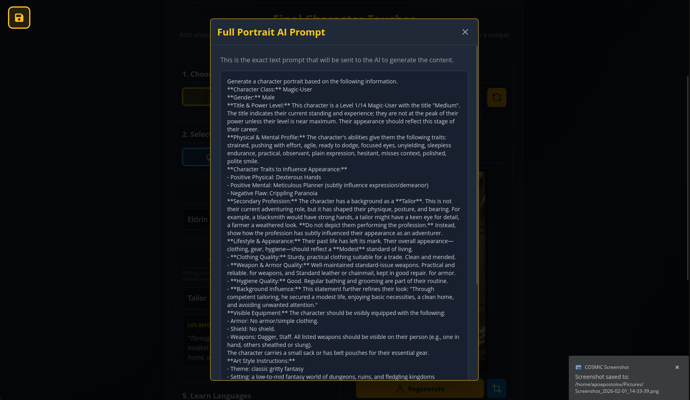
</p>

### 9) Backstory (Two‑Page™)

Generate a rich, multi‑page backstory and read it in a clean, scrollable panel built for long text.

<p align="center">
  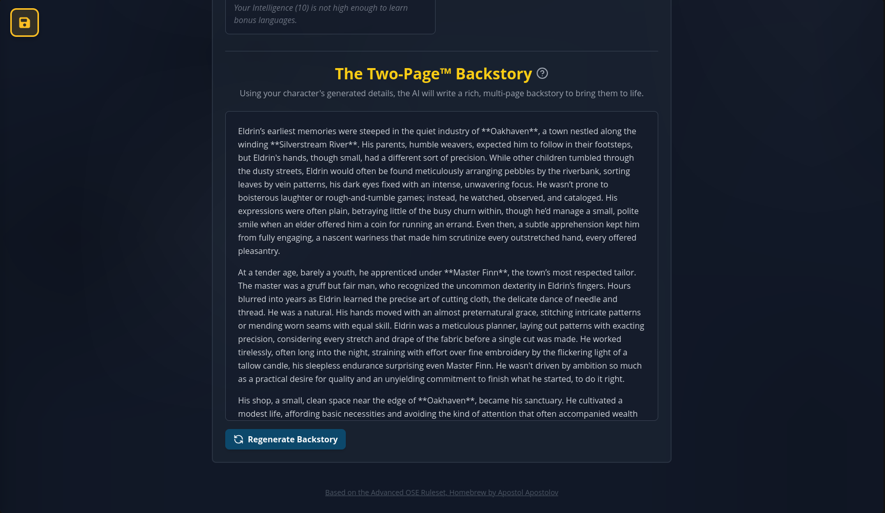
</p>

### 10) Save / Import / Export

Save slots make it easy to update, export, or restore characters. Import a JSON save to bring a character back instantly.

<p align="center">
  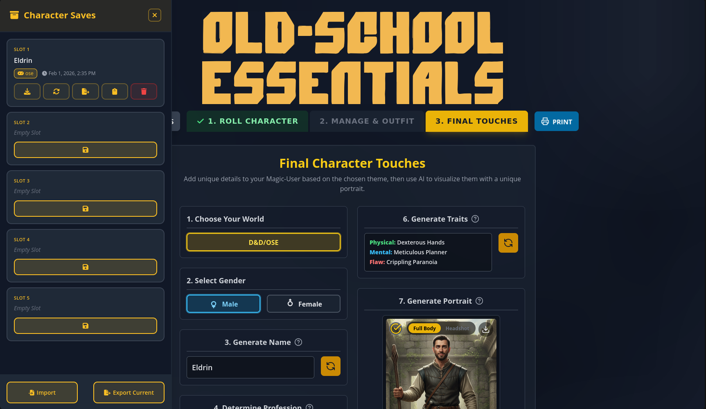
</p>

### 11) PDF Export

Export a complete, print‑ready OSE character sheet with equipment, portrait, and all the derived stats filled in.

<p align="center">
  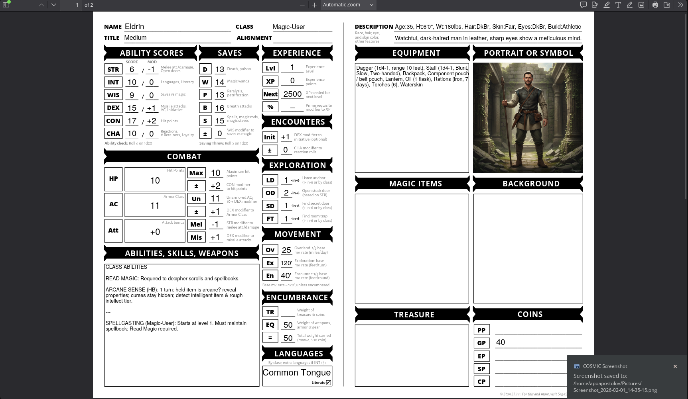
</p>

## Getting Started

### Prerequisites

- Node.js 18+
- npm

### Install & Run (Dev)

```bash
npm install
npm run dev
```

### Build (Production)

```bash
npm install
npm run build
npm run preview
```

## Environment Variables

AI features require a Google Gemini API key.

- Copy `.env.example` to `.env`
- Set `VITE_GEMINI_API_KEY` to your key

```bash
cp .env.example .env
```

## Scripts

- `npm run dev` — start Vite dev server
- `npm run build` — production build
- `npm run preview` — preview the production build
- `npm test` — run tests

## License

MIT. See `LICENSE`.
