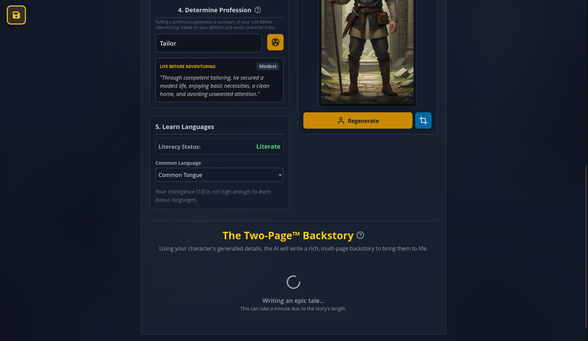
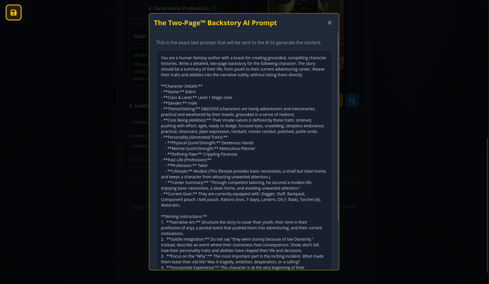

# Old-School Essentials Character Creator

A full-featured character generator for Old-School Essentials (OSE). Roll classic stats, select races and classes, manage gear and encumbrance, and export a print-ready PDF. The app also supports optional AI-powered name, trait, portrait, and backstory generation using Google Gemini.

This project integrates **Apostol Apostolov's extensive houserules for Old School Essentials**. Read the full rules here: [rules/OSE_HOUSE_RULES.md](rules/OSE_HOUSE_RULES.md).

## Badges


## Player Journey (Feature Walkthrough)

### 1) Start & Roll Your Character
Begin on the Roll Character tab. From here you can roll stats, open sources, and move through the character flow.

<p align="center">
  
  
</p>

### 2) Manual Scores (DM Approved)
If your table uses manual scores, a DM approval gate appears before entering values. The manual entry screen includes quick-fill helpers for common formats.

<p align="center">
  
  
</p>

### 3) Choose Content Sources
Enable third‑party sources to expand available classes, items, and themes. Sources are additive and can be toggled per character.

<p align="center">
  
</p>

### 4) Pick Race & Class
Races and classes show requirements, modifiers, and eligibility. Detail modals give full rules context before you commit.

<p align="center">
  
  
  
</p>

### 5) Manage & Outfit
Set starting level, roll starting money, then choose a kit or customize your loadout. HP and wealth breakdowns are shown in-line.

<p align="center">
  
  
  
</p>

### 6) Customize Equipment
Drag items between the catalog and your inventory to fine‑tune gear. Remaining gold and weight update in real time.

<p align="center">
  
</p>

### 7) Starting Magic (Spellcasters)
Pick favorite spells and let the system determine a starting spell, with a choice to keep or replace.

<p align="center">
  
  
</p>

### 8) Grog Hireling
Fragile spellcasters can generate a personal grog with stats, gear, and a portrait for quick table readiness.

<p align="center">
  
</p>

### 9) Final Touches (AI‑Enhanced)
Choose world and gender, generate name and traits, then produce a portrait with clear, inspectable prompts.

<p align="center">
  
  
</p>

### 10) Backstory (Two‑Page™)
Generate a rich, multi‑page backstory with full prompt transparency and a readable output panel.

<p align="center">
  
  
  
</p>

### 11) Save / Import / Export
Save slots let you load, update, and export characters. Import JSON to restore a saved character.

<p align="center">
  
</p>

### 12) PDF Export
Export a complete, print‑ready OSE character sheet with equipment, portrait, and derived stats.

<p align="center">
  
</p>

## Getting Started

### Prerequisites

- Node.js 18+
- npm

### Install & Run (Dev)

```bash
npm install
npm run dev
```

### Build (Production)

```bash
npm install
npm run build
npm run preview
```

## Environment Variables

AI features require a Google Gemini API key.

- Copy `.env.example` to `.env`
- Set `VITE_GEMINI_API_KEY` to your key

```bash
cp .env.example .env
```

## Scripts

- `npm run dev` — start Vite dev server
- `npm run build` — production build
- `npm run preview` — preview the production build
- `npm test` — run tests

## House Rules

This project includes a full set of integrated houserules authored by Apostol Apostolov. See: [rules/OSE_HOUSE_RULES.md](rules/OSE_HOUSE_RULES.md).

## License

MIT. See `LICENSE`.
