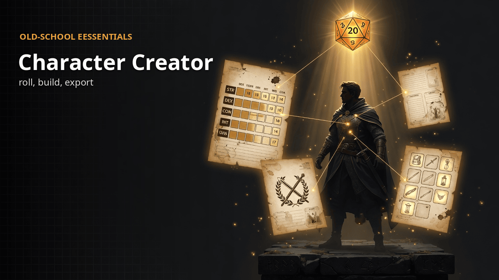
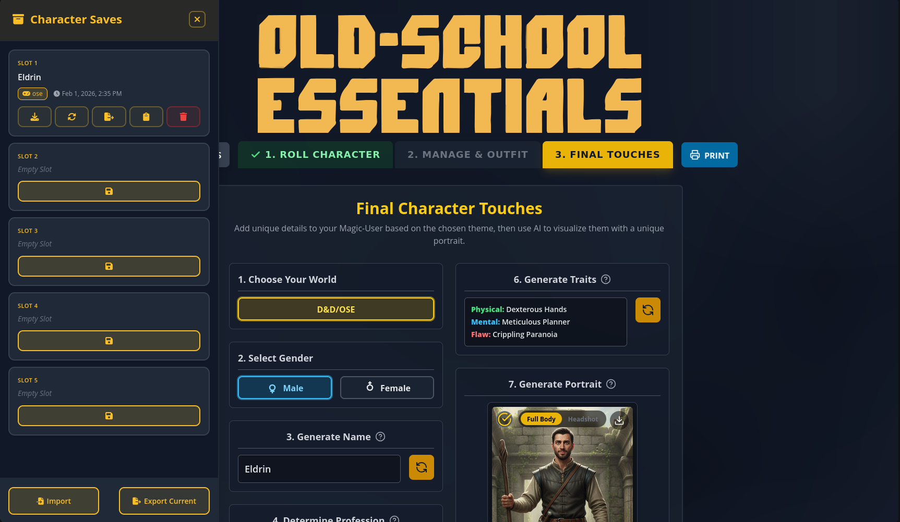

<!-- markdownlint-disable MD013 -->

<div align="center">
  <a href="https://github.com/apoapostolov/Old-School-Essentials-Character-Creator">
    
  </a>
</div>

# Old-School Essentials Character Creator

*Build an OSE character from first roll to print-ready sheet, with source packs, house rules, equipment, saves, and optional AI details.*


This browser-based creator keeps the full character-building journey in one guided workspace. Roll or enter abilities, choose a race and class, manage progression and equipment, add final details, save the result, and print a filled OSE sheet. The default rules follow this project's OSE Reforged house rules, while optional source packs can expand the available content.



## What's New in 1.1.0

- Assign separate providers and models to creative writing, short text, vision, and image generation.
- Use OpenAI, Anthropic, Gemini, OpenRouter, xAI, Z.ai, DeepSeek, or OpenCode Go, including xAI device-code sign-in.
- Load heavy catalogs and print tooling only when needed for a faster first visit.
- Import, copy, download, and restore character JSON with clearer save and load errors.

See the full [changelog](./CHANGELOG.md).

## What You Can Do

- **Build a complete OSE character.** Move through rolling, race and class selection, progression, equipment, final details, and printing without rebuilding derived values by hand.
- **Combine supported source packs.** Start with Advanced OSE/D&D 1e, then mix in The Shrike, Dolmenwood, Gods of the Forbidden North, Mystara, or The Complete Northland Saga.
- **Use the project's Reforged rules.** Ability adjustments, racial hit dice, class data, silver-based advancement, encumbrance, magic, and downtime follow the maintained house-rules reference.
- **Outfit the character with live totals.** Apply equipment kits or customize individual items while money, carried weight, movement, combat values, and class requirements update.
- **Handle class-specific choices.** Manage spell selection, specialist skill progressions, favored terrain, and eligible caster grogs in the same character record.
- **Add optional generated details.** Create names, traits, professions, portraits, and long-form backstories with a provider and model chosen for each task.
- **Keep and move characters.** Store five browser-local save slots, restore them later, or import and export JSON through files or the clipboard.
- **Print the finished sheet.** Export a filled OSE PDF with derived statistics, equipment, languages, abilities, portrait, and other supported character details.

## Quick Start

1. Open **Sources** and choose the content packs for this character.
2. Roll abilities, or use the clearly marked manual-entry path when your table approves custom scores. Pick a race and class after reviewing their requirements and rules.
3. Set level, hit points, wealth, equipment, magic, and specialist choices. Add final details if wanted, save the character, then select **Print**.

The app can be used without AI. Generated names, text, and images remain optional additions to the core OSE workflow.

## Installation

### Requirements

- Node.js 18 or later
- npm

```bash
git clone https://github.com/apoapostolov/Old-School-Essentials-Character-Creator.git
cd Old-School-Essentials-Character-Creator
npm install
npm run dev
```

Vite prints the local address when the development server starts.

For a production preview:

```bash
npm run build
npm run preview
```

## Other Old-School Essentials Modules

| Name | Description |
| --- | --- |
| [OSE Reforged Rules](https://github.com/apoapostolov/OSE-Reforged-Rules-for-Foundry-VTT) | Class-feature compendium and automation for OSE Reforged Rules. |
| [OSE Combat Improvements](https://github.com/apoapostolov/OSE-Combat-Improvements-for-Foundry-VTT) | Combat-tracker declareables and controls for OSE. |
| [OSE Statblock Importer](https://github.com/apoapostolov/OSE-Statblock-Importer-for-Foundry-VTT) | Import and export OSE/BX character and monster text. |
| [Old-School Essentials Character Creator](https://github.com/apoapostolov/Old-School-Essentials-Character-Creator) | Web character generator for OSE with print-ready sheets and optional AI assists. |

## Optional AI Setup and Privacy

Open the in-app **Settings** panel to choose a provider, key, and model for each AI task. Provider keys entered there are remembered in browser storage. Build-time environment keys are also supported; see the provider names and variables in [the AI provider notes](docs/SHARED_AI_PROVIDERS_ZHIPU_GROK.md).

AI requests leave the browser and go to the provider selected for that task. Review the generated prompt before sending sensitive character or campaign material. xAI SuperGrok sign-in uses a device-code flow and needs the Vite OAuth proxy supplied by `npm run dev`; a static host must provide an equivalent proxy.

The character saves and selected source list use browser `localStorage`. Export JSON if you want a portable backup before clearing site data.

## Rules and Content

The maintained rules reference is [rules/OSE_HOUSE_RULES.md](rules/OSE_HOUSE_RULES.md). It covers the project's combat math, score generation, survivability, classes, advancement, spell access, alignment, encumbrance, group checks, grogs, and downtime procedures.

Optional source packs are loaded from `third-party/`. Their names and publishers remain visible in the source picker so users can tell which material is active.

## Support

Support, feedback, and feature ideas: [@ApoMakesMods](https://x.com/ApoMakesMods) on X.

## License

MIT. See [LICENSE](LICENSE).
